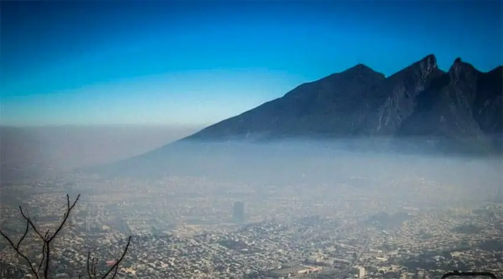
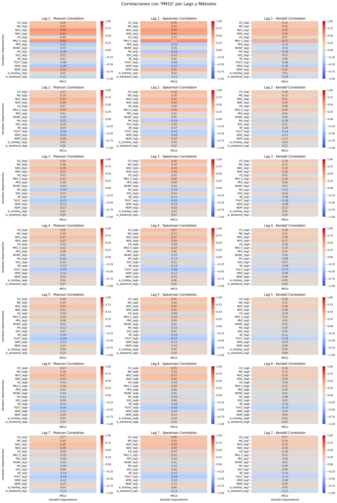
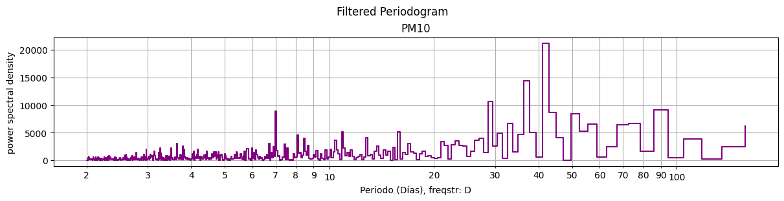
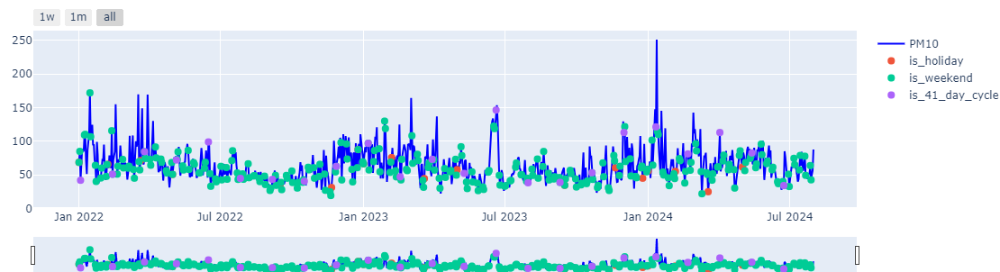
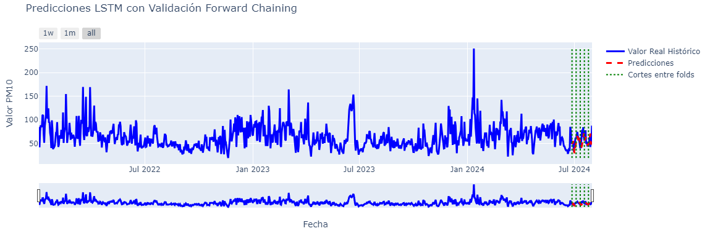

# Air Quality Prediction in Monterrey

This repository contains the implementation and analysis of a predictive model aimed at addressing a critical environmental challenge: air pollution in Monterrey, Mexico. Using advanced data science techniques and historical data from January 2022 to July 2024, this project focuses on forecasting key air pollutants (PM10, SO2, CO, and NOX) to support informed decision-making and mitigate the adverse health effects associated with poor air quality.

## 🎯 Project Objective

The goal of this project is to develop a reliable predictive model capable of estimating the concentrations of major air pollutants in Monterrey. By leveraging a combination of statistical analysis, feature engineering, and Long Short-Term Memory (LSTM) neural networks, the project identifies complex temporal patterns and correlations between pollutants and meteorological variables. This work establishes a foundation for proactive air quality management and public health protection.

## 🔑 Key Features

- **Data Preparation**  
  Extensive preprocessing pipeline involving outlier removal, K-Nearest Neighbors (KNN) imputation for missing values, and time aggregation to daily resolution.

- **Feature Engineering**  
  Inclusion of temporal variables such as holidays, weekends, and cyclical patterns (derived from periodogram analysis) to improve model performance.

- **Exploratory Data Analysis (EDA)**  
  Visual and statistical analysis to uncover seasonality, trends, and dependencies. KPSS and ADF tests were conducted to assess stationarity and guide model selection.

- **Modeling with LSTM**  
  Implementation of a Long Short-Term Memory neural network tailored to time series forecasting. The architecture was fine-tuned to balance short- and long-term dependencies using relevant features and optimized hyperparameters.

## 📈 Results Overview

Below are some visualizations showcasing each phase of the workflow, from analysis to predictions by just giving an example for the PM10 pollutant:

### 🔗 Correlation Analysis  
Identifying interdependencies between pollutants and meteorological factors.

### 📊 Periodogram Analysis  
Uncovering cyclical behaviors in pollutant data over time.

### ⏳ Time Series Visualization  
Time series plot with engineered features showing patterns in PM10 concentrations.

### 🤖 Prediction Results  
Model predictions versus observed values, highlighting the model’s performance and error margins.

### 🗺️ Spatial Distribution  
Mapping predictions across different areas of the city.

[PM10 Mapa Predictions](assets/Mapa_Prediccion_PM10.png)

## Why This Matters

Air pollution in Monterrey is a pressing issue, primarily driven by industrial activity, vehicular emissions, and local meteorological conditions. This repository represents a step towards leveraging modern machine learning techniques to predict pollution levels, inform mitigation strategies, and protect vulnerable populations.
